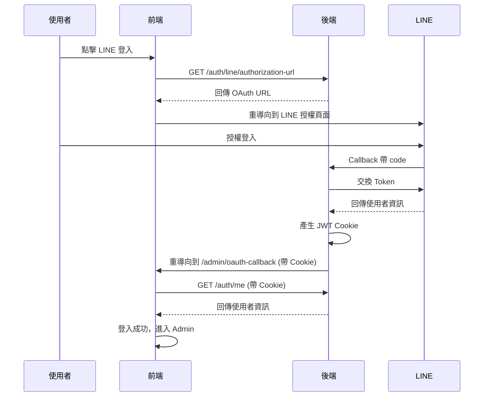

# 71bk Landing Backend API 文件

> **Base URL**: `https://esthetical-lashon-uncharitably.ngrok-free.dev/api`  
> **版本**: 1.0.0  
> **更新日期**: 2026-01-02

---

## 重要設定

### 跨域請求 (CORS)

前端必須正確設定才能與後端通訊：

```typescript
// Axios 設定範例
import axios from 'axios';

const api = axios.create({
  baseURL: 'https://esthetical-lashon-uncharitably.ngrok-free.dev/api',
  withCredentials: true,  // ⚠️ 必須設定！否則 Cookie 不會被發送
  headers: {
    'Content-Type': 'application/json',
  },
});

export default api;
```

```typescript
// Fetch 設定範例
fetch('https://esthetical-lashon-uncharitably.ngrok-free.dev/api/auth/me', {
  credentials: 'include',  // ⚠️ 必須設定！
});
```

### Cookie 設定

| 屬性 | 值 |
|------|-----|
| Cookie Name | `line_token` |
| Refresh Cookie | `line_refresh_token` |
| HttpOnly | `true` |
| Secure | `true` |
| SameSite | `None` |

> [!IMPORTANT]
> Cookie 是由後端設定，前端只需確保 `withCredentials: true` 即可自動攜帶。

---

## 統一回應格式

所有 API 都使用以下格式回應：

```typescript
interface Result<T> {
  success: boolean;
  code: number;       // HTTP 狀態碼
  message: string;
  data: T | null;
  path: string;       // 請求路徑
}
```

### 成功回應範例 (200 OK)
```json
{
  "success": true,
  "code": 200,
  "message": "OK",
  "data": { ... },
  "path": "/api/auth/me"
}
```

### 錯誤回應範例 (401 Unauthorized)
```json
{
  "success": false,
  "code": 401,
  "message": "Unauthorized",
  "data": null,
  "path": "/api/auth/me"
}
```

---

## 認證 API (`/auth`)

### 1. 取得 LINE 登入 URL

取得 OAuth 登入的重導向 URL。

| 項目 | 值 |
|------|-----|
| Method | `GET` |
| Path | `/auth/line/authorization-url` |
| 認證 | 不需要 |

**Response Data**
```typescript
string  // LINE OAuth 授權 URL
```

**範例**
```json
{
  "success": true,
  "code": 200,
  "message": "OK",
  "data": "https://esthetical-lashon-uncharitably.ngrok-free.dev/api/oauth2/authorization/line",
  "path": "/api/auth/line/authorization-url"
}
```

---

### 2. 取得當前登入使用者

驗證 Cookie 並回傳使用者資訊。

| 項目 | 值 |
|------|-----|
| Method | `GET` |
| Path | `/auth/me` |
| 認證 | 需要 (Cookie) |

**Response Data**
```typescript
interface AuthUserResponse {
  lineUserId: string;
  displayName: string;
  pictureUrl: string;
}
```

**錯誤代碼**
| Code | Message | 說明 |
|------|---------|------|
| 401 | Unauthorized | 未登入或 Token 過期 |
| 403 | Admin access required | 非管理員帳號 |

---

### 3. 刷新 Token

使用 Refresh Token 取得新的 Access Token。

| 項目 | 值 |
|------|-----|
| Method | `POST` |
| Path | `/auth/refresh` |
| 認證 | 需要 (Refresh Cookie) |

**Response Data**
```typescript
string  // 新的 Access Token
```

---

### 4. 登出

清除登入 Cookie。

| 項目 | 值 |
|------|-----|
| Method | `POST` |
| Path | `/auth/logout` |
| 認證 | 不需要 |

---

## Admin - 作品集管理 (`/admin/portfolio/projects`)

> [!NOTE]
> 所有 Admin API 都需要 ADMIN 權限。

### 1. 列出所有專案

| 項目 | 值 |
|------|-----|
| Method | `GET` |
| Path | `/admin/portfolio/projects` |

**Query Parameters**
| 參數 | 類型 | 必填 | 說明 |
|------|------|------|------|
| status | string | 否 | 狀態篩選 |
| category | string | 否 | 類別篩選 |
| featured | boolean | 否 | 精選篩選 |
| q | string | 否 | 關鍵字搜尋 |
| page | number | 否 | 頁碼 (>=0) |
| size | number | 否 | 每頁筆數 (1~100) |

---

### 2. 取得專案詳情

| 項目 | 值 |
|------|-----|
| Method | `GET` |
| Path | `/admin/portfolio/projects/{id}` |

---

### 3. 建立專案

| 項目 | 值 |
|------|-----|
| Method | `POST` |
| Path | `/admin/portfolio/projects` |

---

### 4. 更新專案

| 項目 | 值 |
|------|-----|
| Method | `PUT` |
| Path | `/admin/portfolio/projects/{id}` |

---

### 5. 刪除專案

| 項目 | 值 |
|------|-----|
| Method | `DELETE` |
| Path | `/admin/portfolio/projects/{id}` |

---

## Admin - Uploads (`/admin/uploads`)

> [!NOTE]
> Admin auth required.

### 1. Upload image

| Item | Value |
|------|-----|
| Method | `POST` |
| Path | `/admin/uploads` |

**Request Body (multipart/form-data)**
```text
file: <image>
```

**Response Data**
```typescript
interface AdminUploadResponse {
  url: string;
  path: string;
  fileName: string;
  contentType: string;
  size: number;
}
```

---

## Admin - Techs (`/admin/portfolio/techs`)

> [!NOTE]
> Admin auth required.

### 1. List techs

| 項目 | 值 |
|------|-----|
| Method | `GET` |
| Path | `/admin/portfolio/techs` |

**Query Parameters**
| 參數 | 類型 | 必填 | 說明 |
|------|------|------|------|
| q | string | 否 | 關鍵字搜尋 |

**Response Data**
```typescript
AdminTechResponse[]
```

---

### 2. Get tech

| 項目 | 值 |
|------|-----|
| Method | `GET` |
| Path | `/admin/portfolio/techs/{id}` |

**Response Data**
```typescript
AdminTechResponse
```

---

### 3. Create tech

| 項目 | 值 |
|------|-----|
| Method | `POST` |
| Path | `/admin/portfolio/techs` |

**Request Body**
```typescript
interface AdminTechUpsertRequest {
  name: string;
}
```

**Response Data**
```typescript
AdminTechResponse
```

---

### 4. Update tech

| 項目 | 值 |
|------|-----|
| Method | `PUT` |
| Path | `/admin/portfolio/techs/{id}` |

**Request Body**
```typescript
interface AdminTechUpsertRequest {
  name: string;
}
```

**Response Data**
```typescript
AdminTechResponse
```

---

### 5. Delete tech

| 項目 | 值 |
|------|-----|
| Method | `DELETE` |
| Path | `/admin/portfolio/techs/{id}` |

---

## Admin - Project Techs (`/admin/portfolio/projects/{projectId}/techs`)

> [!NOTE]
> Admin auth required.

### 1. List project techs

| Item | Value |
|------|-----|
| Method | `GET` |
| Path | `/admin/portfolio/projects/{projectId}/techs` |

**Response Data**
```typescript
AdminTechResponse[]
```

---

### 2. Replace project techs

| Item | Value |
|------|-----|
| Method | `PUT` |
| Path | `/admin/portfolio/projects/{projectId}/techs` |

**Request Body**
```typescript
interface AdminProjectTechsRequest {
  techs: string[];
}
```

---

## Admin - Project Links (`/admin/portfolio/projects/{projectId}/links`)

> [!NOTE]
> Admin auth required.

### 1. List project links

| Item | Value |
|------|-----|
| Method | `GET` |
| Path | `/admin/portfolio/projects/{projectId}/links` |

**Response Data**
```typescript
AdminProjectLinkResponse[]
```

---

### 2. Get project link

| Item | Value |
|------|-----|
| Method | `GET` |
| Path | `/admin/portfolio/projects/{projectId}/links/{linkId}` |

---

### 3. Create project link

| Item | Value |
|------|-----|
| Method | `POST` |
| Path | `/admin/portfolio/projects/{projectId}/links` |

**Request Body**
```typescript
interface AdminProjectLinkRequest {
  type: string;
  url: string;
  label?: string;
  sortOrder?: number;
}
```

---

### 4. Update project link

| Item | Value |
|------|-----|
| Method | `PUT` |
| Path | `/admin/portfolio/projects/{projectId}/links/{linkId}` |

**Request Body**
```typescript
interface AdminProjectLinkRequest {
  type: string;
  url: string;
  label?: string;
  sortOrder?: number;
}
```

---

### 5. Delete project link

| Item | Value |
|------|-----|
| Method | `DELETE` |
| Path | `/admin/portfolio/projects/{projectId}/links/{linkId}` |

---

## Admin - Dashboard (`/admin/dashboard`)

> [!NOTE]
> Admin auth required.

### 1. Summary

| 項目 | 值 |
|------|-----|
| Method | `GET` |
| Path | `/admin/dashboard/summary` |

**Query Parameters**
| 參數 | 類型 | 必填 | 說明 |
|------|------|------|------|
| days | number | 否 | 近期訊息統計天數（<=0 表示全部） |

**Response Data**
```typescript
interface AdminDashboardSummaryResponse {
  totalProjects: number;
  totalViews: number;   // PAGE_VIEW + PROJECT_VIEW
  lineUsers: number;
  recentMessages: number;
}
```

---

### 2. Events

| 項目 | 值 |
|------|-----|
| Method | `GET` |
| Path | `/admin/dashboard/events` |

**Query Parameters**
| 參數 | 類型 | 必填 | 說明 |
|------|------|------|------|
| page | number | 否 | 頁碼 (>=0) |
| size | number | 否 | 每頁筆數 (1~100，預設 6) |
| limit | number | 否 | 舊參數，等同 size |

**Response Data**
```typescript
interface AdminDashboardEventsResponse {
  events: AdminDashboardEventResponse[];
  page: number;
  size: number;
  totalElements: number;
  totalPages: number;
}

interface AdminDashboardEventResponse {
  id: number;
  time: string;       // yyyy-MM-dd HH:mm
  eventType: string;
  user?: string | null;
  status: string;
}
```

---

## Admin - 分析數據 (`/admin/analytics`)

### 1. 總覽數據

| 項目 | 值 |
|------|-----|
| Method | `GET` |
| Path | `/admin/analytics` |

**Query Parameters**
| 參數 | 類型 | 必填 | 說明 |
|------|------|------|------|
| days | number | 否 | 統計天數 |

---

### 2. 熱門專案

| 項目 | 值 |
|------|-----|
| Method | `GET` |
| Path | `/admin/analytics/projects` |

**Query Parameters**
| 參數 | 類型 | 必填 | 說明 |
|------|------|------|------|
| days | number | 否 | 統計天數 |
| limit | number | 否 | 筆數限制 |

---

### 3. 熱門連結

| 項目 | 值 |
|------|-----|
| Method | `GET` |
| Path | `/admin/analytics/links` |

**Query Parameters**
| 參數 | 類型 | 必填 | 說明 |
|------|------|------|------|
| days | number | 否 | 統計天數 |
| limit | number | 否 | 筆數限制 |

---


### 4. Project analytics detail

| Item | Value |
|------|-----|
| Method | `GET` |
| Path | `/admin/analytics/projects/{projectId}` |

**Query Parameters**
| Item | Type | Required | Description |
|------|------|------|------|
| days | number | no | range in days |

**Response Data**
```typescript
interface AdminProjectAnalyticsResponse {
  projectId: number;
  slug: string;
  titleZh?: string;
  titleEn?: string;
  views: number;
  linkClicks: number;
  viewsByDay: { date: string; count: number }[];
  linkClicksByDay: { date: string; count: number }[];
}
```

---

## Admin - LINE 管理 (`/admin/line`)

### 1. 推播訊息

| 項目 | 值 |
|------|-----|
| Method | `POST` |
| Path | `/admin/line/users/{lineUserId}/messages` |

**Request Body**
```typescript
interface LinePushRequest {
  message: string;
}
```

---

### 2. 列出 LINE 使用者

| 項目 | 值 |
|------|-----|
| Method | `GET` |
| Path | `/admin/line/users` |

**Query Parameters**
| 參數 | 類型 | 必填 | 說明 |
|------|------|------|------|
| q | string | 否 | 搜尋關鍵字 |
| page | number | 否 | 頁碼 |
| size | number | 否 | 每頁筆數 |

---

### 3. 列出使用者訊息

| 項目 | 值 |
|------|-----|
| Method | `GET` |
| Path | `/admin/line/users/{lineUserId}/messages` |

**Query Parameters**
| 參數 | 類型 | 必填 | 說明 |
|------|------|------|------|
| direction | string | 否 | 訊息方向 |
| status | string | 否 | 訊息狀態 |
| page | number | 否 | 頁碼 |
| size | number | 否 | 每頁筆數 |

---

## Public API (`/public`)

> [!TIP]
> Public API 不需要認證，可直接呼叫。

### 1. 列出公開專案

| 項目 | 值 |
|------|-----|
| Method | `GET` |
| Path | `/public/portfolio/projects` |

**Query Parameters**
| 參數 | 類型 | 必填 | 說明 |
|------|------|------|------|
| q | string | 否 | 搜尋關鍵字 |
| tech | string | 否 | 技術篩選 |
| category | string | 否 | 類別篩選 |
| featured | boolean | 否 | 精選篩選 |
| locale | string | 否 | 語系 (zh-TW, en) |
| page | number | 否 | 頁碼 (>=0) |
| size | number | 否 | 每頁筆數 (1~100) |

**Response Data**
```typescript
interface PublicProjectSummaryResponse {
  id: number;
  slug: string;
  title: string;
  summary: string | null;
  coverImageUrl: string | null;
  category: string | null;
  featured: boolean;
  sortOrder: number;
  difficultyScore: number | null;
  impactScore: number | null;
  publishedAt: string | null;
  techs: string[];
}
```

---

### 2. 取得專案詳情

| 項目 | 值 |
|------|-----|
| Method | `GET` |
| Path | `/public/portfolio/projects/{slug}` |

**Query Parameters**
| 參數 | 類型 | 必填 | 說明 |
|------|------|------|------|
| locale | string | 否 | 語系 |

**Response Data**
```typescript
interface PublicProjectDetailResponse {
  id: number;
  slug: string;
  title: string;
  summary: string | null;
  contentMd: string | null;
  coverImageUrl: string | null;
  category: string | null;
  featured: boolean;
  sortOrder: number;
  difficultyScore: number | null;
  impactScore: number | null;
  publishedAt: string | null;
  techs: string[];
  links: PublicProjectLinkResponse[];
}
```

---

### 3. 記錄分析事件

| 項目 | 值 |
|------|-----|
| Method | `POST` |
| Path | `/public/analytics/events` |

**Request Body**
```typescript
interface PublicAnalyticsEventRequest {
  eventType: string;  // 必填
  // 其他欄位...
}
```

---

### 4. AI 聊天查詢

| 項目 | 值 |
|------|-----|
| Method | `POST` |
| Path | `/public/chat/messages` |

**Request Body**
```typescript
interface PublicChatQueryRequest {
  query: string;     // 必填
  locale?: string;
}
```

**Response Data**
```typescript
interface PublicChatResponse {
  projects: PublicChatProjectResponse[];
  suggestedFilters: {
    tech: string[];
    category: string[];
  };
  answer?: PublicChatAnswerResponse | null;
}

interface PublicChatAnswerResponse {
  type: "contact" | "skills";
  payload: Record<string, any>;
}
```

> `answer.type=contact` 時回傳 `{ name, email }`  
> `answer.type=skills` 時回傳 `{ skills: string[], total: number }`

---

## LINE Webhook (`/line`)

> [!CAUTION]
> 此 API 僅供 LINE 平台呼叫，需要正確的 X-Line-Signature 標頭。

### LINE Webhook

| 項目 | 值 |
|------|-----|
| Method | `POST` |
| Path | `/line/webhook` |

**Headers**
| Header | 說明 |
|--------|------|
| X-Line-Signature | LINE 簽章驗證 |

---

## OAuth 登入流程


