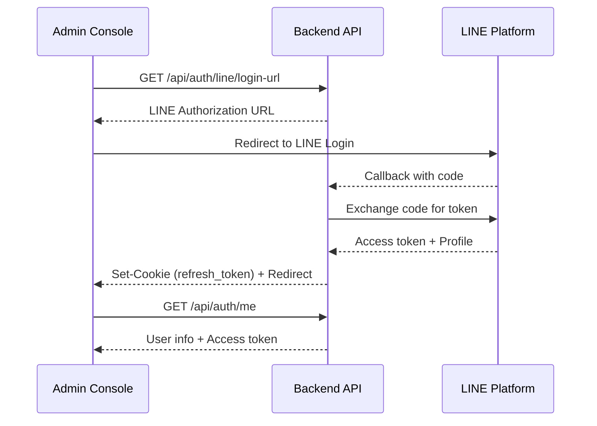

# 71BK Portfolio Platform 整合架構書 v3.0（MySQL / Admin + Public + LINE Bot + Analytics + AI）
作者：71BK  
最後更新：2025-12-23

**Public Portfolio（展示站）**：`https://71bk.dev`（或 `https://www.71bk.dev`）  
**Admin Platform（管理後台）**：`https://profile.71bk.dev`  
**Backend API**：`https://api-profile.71bk.dev`  
**部署方案**：Cloudflare Pages（Public/Admin） + AWS EC2（Nginx → Spring Boot） + MySQL 8

> **本文件目標**：整合「個人作品集 CMS」+「LINE Bot 訊息管理」+「數據統計」+「AI 專案搜尋」的完整系統架構。  
> **核心理念**：先有東西能展示（Public 站先上線），後續逐步補齊後台、統計與 AI。

---

## 1. 專案定位與目標

### 1.1 你在做的不是「靜態作品集」
你在做的是一個 **Portfolio CMS（可登入、可管理、可上架內容）**，並整合多項系統能力：

| 模組 | 功能 | 對象 |
|------|------|------|
| **Admin Console** | 管理作品、封面、排序、精選、LINE 用戶與訊息、推播、數據統計 | 你自己 |
| **Public Portfolio** | 公開展示已上架作品（SEO/分享/瀏覽體驗）+ AI 搜尋助手 | 訪客 |
| **LINE Bot** | 接 webhook、記錄訊息、回覆與推播 | LINE 用戶 |

---

### 1.2 Public Portfolio（給其他人看）
**核心能力**
- 展示作品：列表 / 詳情頁（Case Study）
- 每個作品具備「外部連結」：Demo / GitHub / Docs / Blog / 子網域
- 搜尋 / 篩選：依技術（tech）、類型（category）、精選（featured）

**訪客互動**
- 點擊作品（可統計）
- 點擊外部連結（可統計）
- 使用 AI 搜尋（可統計）

---

### 1.3 Admin Platform（你自己管理）
**內容管理（CMS）**
- 作品 CRUD：標題、摘要、封面、內容、狀態（draft/published/archived）
- 作品排序：sort_order / featured
- 外部連結管理：demo/github/docs/blog

**LINE 訊息管理**
- LINE Users 列表
- Messages 按 user 查詢 message_logs
- Push 選 user 推播訊息

**數據統計（Analytics Dashboard）**
- 作品瀏覽數（project view）
- 外部連結點擊（link click）
- 熱門作品排行
- 熱門搜尋字 / 熱門聊天問題（可選）

---

### 1.4 AI 搜尋助手（Public 站的 chat）
**目標**
- 不是「聊天而已」，是「幫訪客找作品」
- 使用你量化後的資料（tech/category/scores）+ 作品內容（case study text）來檢索與排序

**輸出形式（必須產品化）**
- 回傳 Top N 作品卡片（含 links）
- 每個結果附「為什麼推薦」（match reason）
- 提供可點選的快速篩選建議（suggested filters）

---

## 2. 技術堆疊

### 2.1 Frontend
- **框架**：Vue 3 (Composition API) + Vite
- **狀態管理**：Pinia
- **路由**：Vue Router
- **UI**：Tailwind CSS（可搭配 Element Plus / Headless UI）
- **部署**：Cloudflare Pages（Production/Preview）

### 2.2 Backend
- **框架**：Spring Boot 3 + Spring Security
- **認證**：LINE Login + JWT（Admin API）
- **Webhook**：LINE webhook signature verify（HMAC-SHA256）
- **資料庫**：MySQL 8

### 2.3 Infra
- **前端部署**：Cloudflare Pages（Admin Console / Public Site）
- **後端部署**：AWS EC2（Nginx Reverse Proxy → Spring Boot）
- **DNS / TLS**：Cloudflare 管理

---

## 3. 系統高層架構


---

## 4. 網域與前端切分策略

### 4.1 Domain Split（清楚、好維護）
| 網域 | 用途 | 認證 |
|------|------|------|
| `71bk.dev` | Public Portfolio（公開站） | 無 |
| `profile.71bk.dev` | Admin Console（需要 LINE Login） | JWT |
| `api-profile.71bk.dev` | Backend API（EC2 上） | 依 Endpoint |

這樣的切分可以讓你的作品集「一眼像產品」，也方便做 RBAC 與 CORS。

### 4.2 前端專案結構（推薦：Monorepo 兩個 App）
> 兩個前端分離，維護與安全都更乾淨；你要展示也更清楚。

```
portfolio-system/
  apps/
    admin-console/          # profile.71bk.dev
    public-portfolio/       # 71bk.dev
  packages/
    ui/                     # 共用 UI components (optional)
    api-client/             # 共用 API client / types (optional)
  docs/
    architecture/
  pnpm-workspace.yaml (or npm workspaces)
```

---

## 5. 核心流程

### 5.1 Admin Login（LINE Login → 取得後台 session）
> 這段要寫得「安全、可展示」，避免 redirect 帶 token 的疑慮。

**推薦方案：HttpOnly Refresh Cookie**
1. Admin Console 呼叫：`GET /api/auth/line/login-url`
2. 轉導到 LINE 授權頁
3. LINE callback 到後端：`GET /api/auth/line/callback?code=...`
4. 後端完成：
   - 交換 LINE token / 取得 profile
   - 建立/更新 `admin_users`
   - **Set-Cookie: refresh_token（HttpOnly, Secure, SameSite）**
   - redirect 回前端 `/oauth-callback`
5. 前端進入 callback 頁後呼叫：`GET /api/auth/me`
6. 前端取得 user 資訊與短效 access token（用於後續 `Authorization: Bearer`）

> 展示重點：你理解 **cookie SameSite、跨網域、redirect 安全性**。

---

### 5.2 LINE Webhook（不走 JWT，走簽章驗證）
1. LINE 平台 POST：`/api/line/webhook`
2. 後端驗證：`X-Line-Signature`（HMAC-SHA256）
3. 解析 event，寫入 `line_message_logs (INBOUND)`
4. 視需求回覆或推播，並寫入 `line_message_logs (OUTBOUND)`

✅ **Webhook 必做：冪等性（Idempotency）**
- 每個 event 取得可唯一識別（例如 LINE eventId，或用 payload 組合 hash）
- DB 先查 `event_id` 是否已處理，已存在則直接忽略

---

### 5.3 Admin Push（後台主動推播）
1. Admin Console 呼叫：`POST /api/admin/line/push`
2. 後端驗 JWT + RBAC（僅 admin）
3. 檢查目標 `line_users` 存在
4. 呼叫 LINE Push API
5. 寫入 `line_message_logs (OUTBOUND)` + 狀態（SENT/FAILED）

---

### 5.4 Analytics 事件上報（前端做）
Public 站在這些時機呼叫 `POST /api/public/analytics/event`：
- 進首頁（PAGE_VIEW）
- 進作品詳情（PROJECT_VIEW）
- 點 demo/github（LINK_CLICK）
- 使用站內搜尋（SEARCH）
- 使用 chat（CHAT_QUERY）

---

## 6. 功能架構（產品視角）

### 6.1 Public Portfolio Pages（IA 建議）
- **Home**（Hero + 精選作品）
- **Projects**（列表 + 篩選/搜尋）
- **Project Detail**（case study：Problem/Solution/Architecture/Stack/Links）
- **About**（skills/stack）
- **Contact**（links）
- **Chatbot**（浮動按鈕 / drawer）

### 6.2 Admin Platform Pages（IA 建議）
- **Dashboard**（統計卡片：作品數、published、訊息量、top projects）
- **Portfolio**
  - Projects List（狀態、featured、排序）
  - Project Editor（內容、封面、狀態）
  - Links Editor（demo/github/etc）
- **LINE**
  - Users（line_users 列表）
  - Messages（按 user 查詢 message_logs）
  - Push（選 user 推播訊息）
- **Analytics**
  - Overview（PV、clicks、top）
  - Project Detail Analytics（單一作品）
  - Queries（search/chat top）*可選
- **Settings**（可選：webhook health、env 顯示）

---

## 7. API 設計

### 7.1 Endpoints 總覽
| 分類 | Method | Path | Auth | 說明 |
|------|--------|------|------|------|
| Auth | GET | /api/auth/line/login-url | Public | 取得 LINE 授權連結 |
| Auth | GET | /api/auth/line/callback | Public | LINE callback（後端） |
| Auth | GET | /api/auth/me | Cookie/Token | 取得登入者資訊 |
| Auth | POST | /api/auth/refresh | Cookie | 換新 access token |
| LINE | POST | /api/line/webhook | Signature | LINE Webhook（驗簽章） |
| LINE(Admin) | POST | /api/admin/line/push | JWT | 後台推播 |
| Portfolio(Admin) | CRUD | /api/admin/portfolio/projects | JWT | 後台管理作品 |
| Portfolio(Admin) | CRUD | /api/admin/portfolio/projects/{id}/links | JWT | 管理作品連結 |
| Portfolio(Public) | GET | /api/public/portfolio/projects | Public | 公開作品列表 |
| Portfolio(Public) | GET | /api/public/portfolio/projects/{slug} | Public | 公開作品詳情 |
| Analytics | POST | /api/public/analytics/event | Public | 上報事件 |
| Analytics(Admin) | GET | /api/admin/analytics/overview | JWT | 統計總覽 |
| Analytics(Admin) | GET | /api/admin/analytics/projects/top | JWT | 熱門作品 |
| Chat | POST | /api/public/chat/query | Public | AI 搜尋 |

### 7.2 錯誤回傳格式（建議）
```json
{
  "code": "ERROR_CODE",
  "message": "Human readable message",
  "data": null
}
```

---

## 8. 資料庫設計（MySQL 8）

> 核心理念：Webhook/Push 這類整合系統，**記錄與追蹤**非常重要（才能 debug、才能展示）。

### 8.1 admin_users（後台管理者）
| 欄位 | 類型 | 說明 |
|------|------|------|
| id | PK | |
| line_user_id | VARCHAR(50) UNIQUE | LINE User ID |
| display_name | VARCHAR(100) | |
| picture_url | VARCHAR(500) | |
| role | ENUM('ADMIN') | |
| created_at / updated_at | DATETIME | |

### 8.2 line_users（LINE 用戶）
| 欄位 | 類型 | 說明 |
|------|------|------|
| id | PK | |
| line_user_id | VARCHAR(50) UNIQUE | |
| display_name | VARCHAR(100) | |
| picture_url | VARCHAR(500) | |
| last_seen_at | DATETIME | |
| created_at / updated_at | DATETIME | |

### 8.3 line_message_logs（訊息紀錄：INBOUND / OUTBOUND）
| 欄位 | 類型 | 說明 |
|------|------|------|
| id | PK | |
| event_id | VARCHAR(100) UNIQUE | ✅ 用於冪等性 |
| direction | ENUM('INBOUND','OUTBOUND') | |
| line_user_id | VARCHAR(50) INDEX | |
| message_type | VARCHAR(20) | text/image/etc |
| message_text | TEXT | |
| payload_json | JSON | ✅ 保留原始 payload |
| status | ENUM('SENT','FAILED','RECEIVED') | |
| line_api_response | JSON | |
| created_at | DATETIME | |

### 8.4 portfolio_projects（作品）
| 欄位 | 類型 | 說明 |
|------|------|------|
| id | PK | |
| title | VARCHAR(200) | |
| slug | VARCHAR(100) UNIQUE | ✅ 公開網址用 |
| summary | TEXT | |
| content_md | LONGTEXT | |
| cover_image_url | VARCHAR(500) | |
| status | ENUM('DRAFT','PUBLISHED','ARCHIVED') | |
| featured | BOOLEAN | |
| sort_order | INT | |
| category | ENUM('SYSTEM','FRONTEND','BACKEND','TOOL') | AI/搜尋用 |
| difficulty_score | TINYINT | 1–5 |
| impact_score | TINYINT | 1–5 |
| search_text | LONGTEXT | 聚合 title+summary+content+tech |
| published_at | DATETIME | |
| created_at / updated_at | DATETIME | |

### 8.5 project_links（作品外部連結）
| 欄位 | 類型 | 說明 |
|------|------|------|
| id | PK | |
| project_id | FK | |
| type | ENUM('DEMO','GITHUB','DOC','BLOG','OTHER') | |
| url | VARCHAR(500) | |
| label | VARCHAR(100) | 顯示文字 |
| sort_order | INT | |

### 8.6 portfolio_techs / portfolio_project_techs（技術標籤）
**portfolio_techs**
| 欄位 | 類型 | 說明 |
|------|------|------|
| id | PK | |
| name | VARCHAR(50) UNIQUE | |

**portfolio_project_techs（many-to-many）**
| 欄位 | 類型 | 說明 |
|------|------|------|
| project_id | FK | |
| tech_id | FK | |
| UNIQUE(project_id, tech_id) | | |

### 8.7 analytics_events（事件追蹤）
| 欄位 | 類型 | 說明 |
|------|------|------|
| id | PK | |
| event_type | ENUM | PAGE_VIEW/PROJECT_VIEW/LINK_CLICK/SEARCH/CHAT_QUERY |
| project_id | FK nullable | |
| link_id | FK nullable | |
| path | VARCHAR(500) | 當下頁面 |
| referrer | VARCHAR(500) | |
| session_id | VARCHAR(100) | 匿名即可 |
| meta_json | JSON | 可放 query text / filters |
| created_at | DATETIME | |

---

## 9. CORS / Cookie / Security

### 9.1 CORS（跨網域：Pages ↔ API）
- `profile.71bk.dev` / `71bk.dev` 呼叫 `api-profile.71bk.dev`
- 後端需允許特定 origin（**不要用 `*`**）
- 若使用 cookie（refresh_token）：
  - `Access-Control-Allow-Credentials: true`
  - 前端 axios/fetch 需要 `withCredentials: true`

### 9.2 Cookie 建議（若用 refresh cookie）
- HttpOnly: ✅
- Secure: ✅（HTTPS）
- SameSite: `None`（跨網域需配合 Secure）

### 9.3 Webhook 安全
- webhook endpoint 不需要 JWT
- **只信任簽章驗證**（HMAC-SHA256）
- 建議對 webhook endpoint 做 rate limit / basic WAF

### 9.4 Admin 後台防護
- Rate Limiting（登入嘗試、API 請求）
- IP 白名單（可選）
- JWT 短效期 + Refresh Token 機制

---

## 10. AI 搜尋助手（v1：先做可控且可展示）

### 10.1 資料準備（你的「量化後資料」落地）
- 結構化：techs, category, scores
- 非結構化：content_md / summary
- 聚合欄位：`search_text`

### 10.2 檢索策略（v1 先用 MySQL FULLTEXT）
1. Step A：把 query 拆成可能的 tech/category（規則 or map）
2. Step B：用 tech/category 先縮小候選（結構化）
3. Step C：用 FULLTEXT 對 `search_text` 做相關度排序
4. Step D：回傳 Top N（附 matchReason）

### 10.3 回傳格式（建議）
```json
{
  "projects": [
    { "title": "...", "slug": "...", "summary": "...", "techs": [], "links": [], "score": 0.85, "matchReason": "..." }
  ],
  "suggestedFilters": { "tech": [], "category": [] }
}
```

### 10.4 Chat UI（Public）
- 右下角浮動按鈕 → drawer
- 一次回傳 3–5 個作品卡片
- 每張卡片 2 個按鈕：`Open Detail`、`Open Demo/GitHub`

---

## 11. 部署

### 11.1 Cloudflare Pages
- 兩個 Pages Project（推薦）：
  - `admin-console` → 綁 `profile.71bk.dev`
  - `public-portfolio` → 綁 `71bk.dev`
- 環境變數（Vite）：
  - `VITE_API_BASE_URL=https://api-profile.71bk.dev`

### 11.2 SPA Fallback（避免刷新 404）
- Cloudflare Pages 設定 SPA rewrite（所有非檔案路徑 → `/index.html`）
- 確保 `_redirects` 不會造成 infinite loop

### 11.3 EC2（Nginx → Spring Boot）
- Nginx：`/api/*` → proxy_pass 到 Spring Boot
- Spring Boot：`application-prod.yml` 指向 MySQL
- DB：MySQL 8（可與後端同機或獨立）

### 11.4 資料備份（建議）
- MySQL 定期備份（mysqldump + cron）
- 備份檔上傳 S3 或其他雲端儲存

---

## 12.「先有東西可展示」的執行順序（Demo Roadmap）
> 你擔心後面做不完沒東西展示，所以 roadmap 保證每步都有可展示成品。

### M1：Public Portfolio 上線（最快 1 週內）
**做完就能分享網址**
- Public 前端（Home/Projects/Project Detail）
- Projects 先用 mock data 也行 → 再接 public API
- 每個 project 先放 demo/github（先硬編也 OK）

✅ **展示物**：公開站可瀏覽、作品詳情頁 + 外部連結導向

---

### M2：Database + Public API（替換 mock data）
- MySQL tables（projects/techs/links）
- Public list/detail endpoints

✅ **展示物**：Public 站資料改為動態（DB 來的）

---

### M3：Admin Platform（你開始真的能管理）
- Admin CRUD（上架/下架/封面/排序）
- links 管理
- LINE Login 整合

✅ **展示物**：後台截圖 + 上架後 Public 立即更新

---

### M4：LINE Bot 整合
- Webhook 接收訊息 + 冪等性
- 後台查看 LINE 用戶與訊息
- 後台推播功能

✅ **展示物**：LINE Bot 互動 demo + 後台訊息管理截圖

---

### M5：Analytics v1（產品感大幅上升）
- 只做兩個事件：PROJECT_VIEW + LINK_CLICK（先最有價值）
- 後台 dashboard：total views / clicks / top projects

✅ **展示物**：Dashboard 數據卡片與排行

---

### M6：AI Search v1（你的差異化賣點）
- /chat/query：FULLTEXT + tags filter
- Public chat UI：回傳作品卡片 + match reason

✅ **展示物**：Chatbot demo：輸入「OAuth/JWT/部署」→ 推薦你的作品

---

## 13. 作品集展示建議（讓它看起來像「系統」而非「頁面」）

你在作品集頁面中可以展示：
- 1 張：System diagram（Cloudflare Pages → API → EC2 → MySQL → LINE）
- 1 張：Webhook flow（含 signature verify + idempotency）
- 1 張：Admin Console（Projects 管理頁）截圖
- 1 張：Public Portfolio（Project detail）截圖

並在文字中強調：
- webhook **X-Line-Signature**
- callback/webhook **idempotency**
- admin/public API boundary
- Cloudflare Pages SPA fallback + CORS/cookie 策略

---

## 14. 最小可啟動清單（今天就能開始做）

1. Public 站先做出 Projects list + detail（mock data）
2. Cloudflare Pages 先部署 → 先有網址能展示
3. 同步建 MySQL schema（含 project_links）
4. 做 public list/detail API，替換 mock data
5. 最後再做 admin、LINE Bot、analytics、AI

---

## 15. 當前專案狀態

> 前端開發進度已移至獨立文件，以便前後端協作溝通。

📄 **詳細進度請見**：[前端進度書.md](./前端進度書.md)

### 15.1 快速概覽

| 項目 | 狀態 |
|------|------|
| **專案** | 71bk-landing（Public Portfolio） |
| **階段** | M1 初期（Landing Page 開發中） |
| **技術棧** | Vue 3 + Vite + Tailwind CSS v4 |

### 15.2 開發指令

```bash
# 安裝依賴
npm install

# 啟動開發伺服器
npm run dev

# 建置生產版本
npm run build
```

---

## Appendix A — Mermaid Diagrams

### A.1 System Diagram


### A.2 Admin Login Flow


### A.3 LINE Webhook Flow

