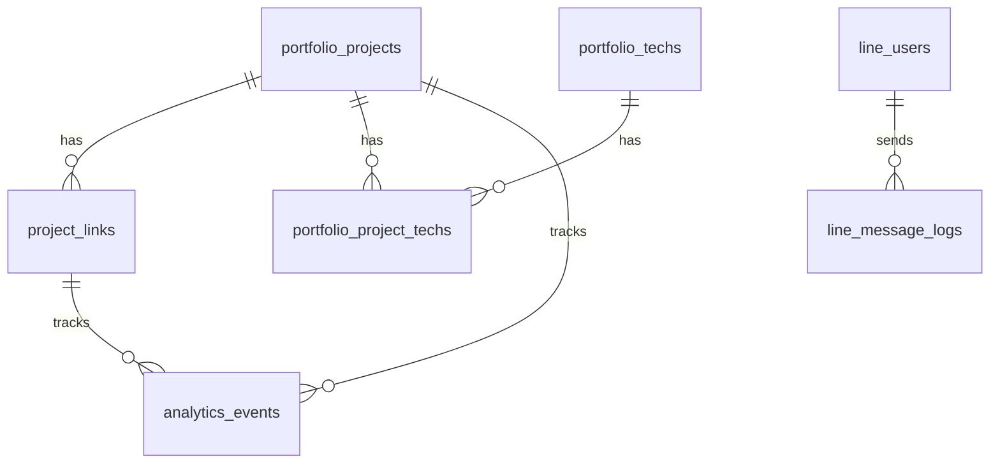

# 71BK Portfolio Platform 技術棧總覽
> 根據架構書 v3.0 整理  
> 最後更新：2025-12-23

---

## 系統架構圖


---

## 前端技術棧

| 技術 | 版本 | 用途 | 說明 |
|------|------|------|------|
| **Vue 3** | 3.x | 核心框架 | 使用 Composition API |
| **Vite** | 5.x | 建構工具 | 快速 HMR、ESM 原生支援 |
| **Pinia** | 2.x | 狀態管理 | Vue 3 官方推薦，取代 Vuex |
| **Vue Router** | 4.x | 路由管理 | 支援 History Mode |
| **Tailwind CSS** | 3.x | CSS 框架 | Utility-first，可搭配 Headless UI |
| **TypeScript** | 5.x | 型別系統 | 提升程式碼品質與 IDE 支援 |
| **Axios** | 1.x | HTTP Client | API 請求，支援攔截器 |

### 前端專案結構
```
apps/
├── admin-console/     # 管理後台 (profile.71bk.dev)
│   ├── src/
│   │   ├── views/     # 頁面元件
│   │   ├── components/# 共用元件
│   │   ├── stores/    # Pinia stores
│   │   ├── services/  # API 服務
│   │   └── router/    # 路由設定
│   └── vite.config.ts
│
└── public-portfolio/  # 公開網站 (71bk.dev)
    ├── src/
    │   ├── views/
    │   ├── components/
    │   ├── services/
    │   └── router/
    └── vite.config.ts
```

---

## 後端技術棧

| 技術 | 版本 | 用途 | 說明 |
|------|------|------|------|
| **Java** | 17+ | 程式語言 | LTS 版本 |
| **Spring Boot** | 3.x | 核心框架 | 自動配置、依賴注入 |
| **Spring Security** | 6.x | 安全框架 | 認證授權、JWT 驗證 |
| **Spring Data JPA** | 3.x | ORM | 簡化資料庫操作 |
| **MySQL** | 8.x | 資料庫 | 關聯式資料庫 |
| **JWT** | - | Token | 無狀態認證（Admin API） |
| **LINE SDK** | 8.x | LINE 整合 | Webhook 驗證、Push API |

### 後端專案結構
```
src/main/java/dev/_71bk/portfolio/
├── config/           # 設定類（Security, CORS, etc.）
├── controller/       # REST Controller
│   ├── admin/        # Admin API (/api/admin/**)
│   ├── public_/      # Public API (/api/public/**)
│   └── line/         # LINE Webhook (/api/line/**)
├── service/          # 業務邏輯
├── repository/       # JPA Repository
├── entity/           # JPA Entity
├── dto/              # 資料傳輸物件
├── security/         # JWT Filter, Auth Handler
└── util/             # 工具類
```

---

## 資料庫設計

### 資料表總覽
| 表名 | 用途 | 備註 |
|------|------|------|
| `admin_users` | 後台管理者 | LINE Login 認證 |
| `line_users` | LINE Bot 用戶 | Webhook 互動記錄 |
| `line_message_logs` | LINE 訊息紀錄 | INBOUND/OUTBOUND |
| `portfolio_projects` | 作品集 | 含 AI 搜尋欄位 |
| `project_links` | 作品外部連結 | Demo/GitHub/Docs |
| `portfolio_techs` | 技術標籤 | 用於篩選 |
| `portfolio_project_techs` | 作品-技術關聯 | 多對多 |
| `analytics_events` | 訪客行為事件 | PV/點擊/搜尋 |

### ER Diagram


---

## 部署架構

### Cloudflare Pages（前端）
| 項目 | 設定 |
|------|------|
| **Admin Console** | 綁定 `profile.71bk.dev` |
| **Public Portfolio** | 綁定 `71bk.dev` |
| **Build Command** | `npm run build` |
| **Output Dir** | `dist/` |
| **SPA Fallback** | `/*` → `/index.html` |
| **環境變數** | `VITE_API_BASE_URL=https://api-profile.71bk.dev` |

### AWS EC2（後端）
| 項目 | 設定 |
|------|------|
| **Nginx** | Reverse Proxy → Spring Boot |
| **Spring Boot** | Port 8080 |
| **MySQL** | Port 3306 |
| **TLS/SSL** | Cloudflare Flexible 或 Full |

### Nginx 配置範例
```nginx
server {
    listen 443 ssl;
    server_name api-profile.71bk.dev;

    location /api/ {
        proxy_pass http://127.0.0.1:8080;
        proxy_set_header Host $host;
        proxy_set_header X-Real-IP $remote_addr;
        proxy_set_header X-Forwarded-For $proxy_add_x_forwarded_for;
        proxy_set_header X-Forwarded-Proto $scheme;
    }
}
```

---

## 安全機制

### 認證與授權
| 機制 | 適用範圍 | 說明 |
|------|----------|------|
| **LINE Login** | Admin 登入 | OAuth 2.0 flow |
| **JWT** | Admin API | Bearer Token（短效）|
| **HttpOnly Cookie** | Refresh Token | 安全存放長效 Token |
| **X-Line-Signature** | LINE Webhook | HMAC-SHA256 驗證 |

### CORS 設定
```java
@Bean
public CorsConfigurationSource corsConfigurationSource() {
    CorsConfiguration config = new CorsConfiguration();
    config.setAllowedOrigins(List.of(
        "https://71bk.dev",
        "https://profile.71bk.dev"
    ));
    config.setAllowedMethods(List.of("GET", "POST", "PUT", "DELETE"));
    config.setAllowCredentials(true);
    return source;
}
```

---

## 開發工具

| 工具 | 用途 |
|------|------|
| **VS Code** | 前端開發 |
| **IntelliJ IDEA** | 後端開發 |
| **DBeaver / phpMyAdmin** | 資料庫管理 |
| **Postman** | API 測試 |
| **Git** | 版本控制 |
| **pnpm** | 前端套件管理（Monorepo） |
| **Maven / Gradle** | 後端依賴管理 |

---

## 版本需求總覽

| 類別 | 技術 | 最低版本 |
|------|------|----------|
| **Runtime** | Node.js | 18.x |
| **Runtime** | Java | 17 |
| **Database** | MySQL | 5.7+ |
| **Framework** | Vue | 3.3+ |
| **Framework** | Spring Boot | 3.0+ |
