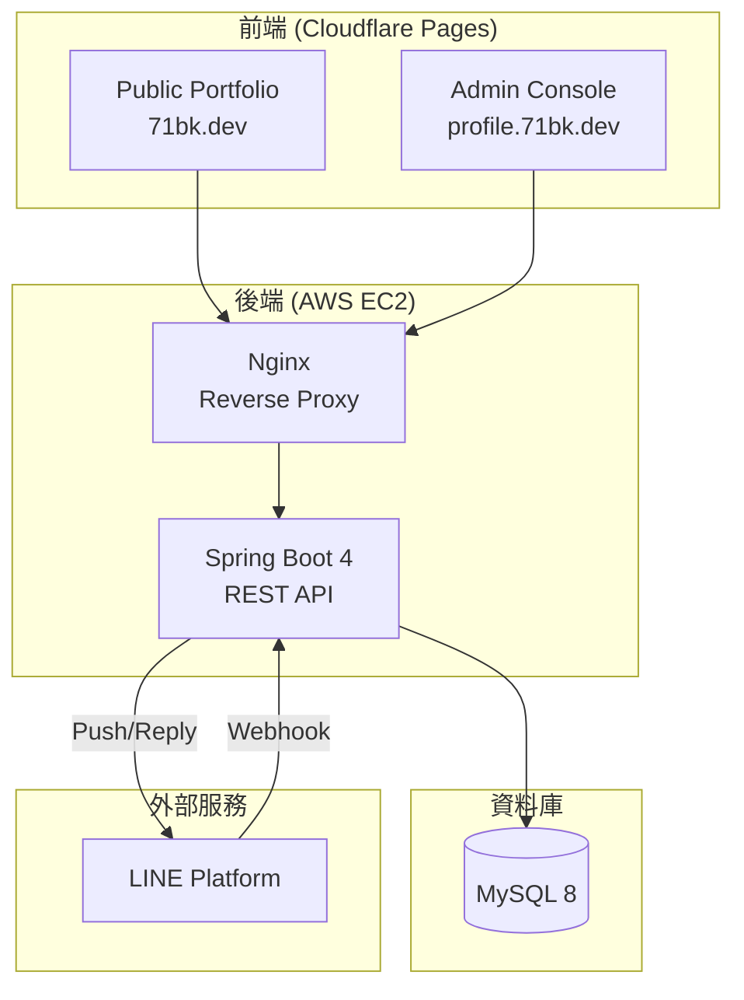
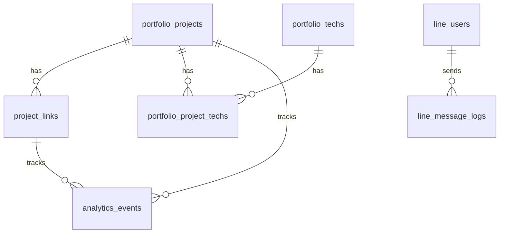
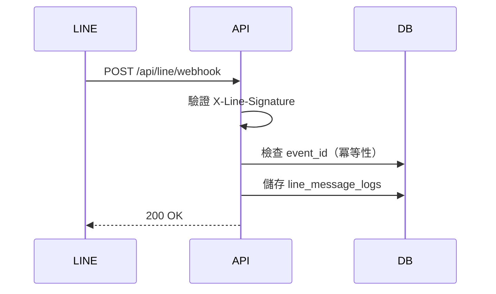

# 71BK Portfolio Platform 技術棧總覽
> 根據架構書 v3.0 + mysql_schema_v3 整理  
> 最後更新：2025-12-26

---

## 系統架構圖



---

## 前端技術棧

| 技術 | 版本 | 用途 | 說明 |
|------|------|------|------|
| **Vue 3** | ^3.5.18 | 核心框架 | 使用 Composition API |
| **Vite** | ^7.1.2 | 建構工具 | 快速 HMR、ESM 原生支援 |
| **Pinia** | ^3.0.4 | 狀態管理 | Vue 3 官方推薦，取代 Vuex |
| **Vue Router** | ^4.6.4 | 路由管理 | 支援 History Mode |
| **vue-i18n** | ^9.14.5 | 國際化 | 中/英雙語支援 |
| **Tailwind CSS** | ^4.1.18 | CSS 框架 | v4 版本，Utility-first |
| **Axios** | ^1.13.2 | HTTP Client | API 請求，支援攔截器 |

### 前端專案結構（71bk-landing）
```
71bk-landing/
├── src/
│   ├── views/              # 頁面視圖
│   │   ├── admin/          # Admin 後台頁面（7 頁）
│   │   └── profile/        # Public 前台頁面
│   ├── components/         # Vue 共用元件
│   │   ├── admin/          # Admin 元件
│   │   └── profile/        # Public 元件
│   │       ├── common/     # 共用（SiteNav, SiteFooter）
│   │       ├── home/       # Home 頁面元件（6 個）
│   │       └── projectDetail/ # 詳情頁元件（6 個）
│   ├── i18n/               # 國際化設定
│   ├── locales/            # 語言檔案（en.json, zh-TW.json）
│   ├── router/             # 路由設定
│   ├── store/              # Pinia 狀態管理
│   ├── styles/             # 全域樣式
│   │   ├── style.css       # 主樣式
│   │   ├── theme-color.css # 主題色彩
│   │   ├── typography.css  # 字型設定
│   │   └── admin.css       # Admin 共用樣式
│   └── api/                # API 模組
└── vite.config.js          # Vite 配置（含 @ alias）
```

---

## 後端技術棧

| 技術 | 版本 | 用途 | 說明 |
|------|------|------|------|
| **Java** | 17+ | 程式語言 | LTS 版本 |
| **Spring Boot** | 4.0.x | 核心框架 | 自動配置、依賴注入 |
| **Spring Security** | 6.x | 安全框架 | OAuth2 Login + JWT Cookie |
| **Spring Security OAuth2 Client** | 6.x | Auth | LINE Login |
| **Spring Data JPA** | 4.x (Boot BOM) | ORM | 簡化資料庫操作 |
| **Spring REST Client** | 4.x (Boot BOM) | HTTP Client | External API |
| **Spring Modulith** | 2.0.0 | Modularity | Module boundaries |
| **MySQL** | 8.x | 資料庫 | 關聯式資料庫 |
| **JJWT** | 0.11.5 | JWT | Access/Refresh tokens |
| **Lombok** | - | Tooling | Reduce boilerplate |

### 後端專案結構（landing/）
```
landing/
|-- pom.xml
|-- compose.yaml
|-- src/
|   |-- main/
|   |   |-- java/tw/bk/landing/
|   |   |   |-- config/
|   |   |   |-- controller/
|   |   |   |-- entity/
|   |   |   |-- repository/
|   |   |   |-- service/
|   |   |   |-- security/
|   |   |   |-- handler/
|   |   |   |-- result/
|   |   |   |-- vo/
|   |   |-- resources/application.yml
|   |-- test/
```

---

## 資料庫設計（v3 雙語支援）

### 資料表總覽
| 表名 | 用途 | 備註 |
|------|------|------|
| `admin_users` | 後台管理者 | LINE Login 認證 |
| `line_users` | LINE Bot 用戶 | Webhook 互動記錄 |
| `line_message_logs` | LINE 訊息紀錄 | INBOUND/OUTBOUND |
| `portfolio_projects` | 作品集 | **v3 雙語欄位**（_zh/_en） |
| `project_links` | 作品外部連結 | Demo/GitHub/Docs |
| `portfolio_techs` | 技術標籤 | 用於篩選 |
| `portfolio_project_techs` | 作品-技術關聯 | 多對多 |
| `analytics_events` | 訪客行為事件 | PV/點擊/搜尋 |

### ER Diagram


---

## 部署架構

### Cloudflare Pages（前端）
| 項目 | 設定 |
|------|------|
| **Admin Console** | 綁定 `profile.71bk.dev` |
| **Public Portfolio** | 綁定 `71bk.dev` |
| **Build Command** | `npm run build` |
| **Output Dir** | `dist/` |
| **SPA Fallback** | `/*` → `/index.html` |
| **環境變數** | `VITE_API_BASE_URL=https://api-profile.71bk.dev` |

### AWS EC2（後端）
| 項目 | 設定 |
|------|------|
| **Nginx** | Reverse Proxy → Spring Boot |
| **Spring Boot** | Port 8080 |
| **MySQL** | Port 3306 |
| **TLS/SSL** | Cloudflare Flexible 或 Full |

### Nginx 配置範例
```nginx
server {
    listen 443 ssl;
    server_name api-profile.71bk.dev;

    location /api/ {
        proxy_pass http://127.0.0.1:8080;
        proxy_set_header Host $host;
        proxy_set_header X-Real-IP $remote_addr;
        proxy_set_header X-Forwarded-For $proxy_add_x_forwarded_for;
        proxy_set_header X-Forwarded-Proto $scheme;
    }
}
```

---

## 安全機制

### 認證與授權
| 機制 | 適用範圍 | 說明 |
|------|----------|------|
| **LINE Login** | Admin 登入 | OAuth 2.0 flow |
| **JWT** | Admin API | Cookie-based access token（短效）|
| **HttpOnly Cookie** | Access/Refresh Token | 安全存放長效 Token |
| **X-Line-Signature** | LINE Webhook | HMAC-SHA256 驗證 |

### CORS 設定
```java
@Bean
public CorsConfigurationSource corsConfigurationSource() {
    CorsConfiguration config = new CorsConfiguration();
    config.setAllowedOrigins(List.of(
        "https://71bk.dev",
        "https://profile.71bk.dev"
    ));
    config.setAllowedMethods(List.of("GET", "POST", "PUT", "DELETE"));
    config.setAllowCredentials(true);
    return source;
}
```

---

## 開發工具

| 工具 | 用途 |
|------|------|
| **VS Code** | 前端開發 |
| **IntelliJ IDEA** | 後端開發 |
| **DBeaver / phpMyAdmin** | 資料庫管理 |
| **Postman** | API 測試 |
| **Git** | 版本控制 |
| **npm** | 前端套件管理 |
| **Maven** | 後端依賴管理 |

---

## 版本需求總覽

| 類別 | 技術 | 最低版本 |
|------|------|----------|
| **Runtime** | Node.js | 18.x |
| **Runtime** | Java | 17 |
| **Database** | MySQL | 8.0+ |
| **Framework** | Vue | 3.3+ |
| **Framework** | Spring Boot | 4.0+ |

---

## API 設計概覽

### API 端點分類
| 分類 | Path 前綴 | Auth | 說明 |
|------|-----------|------|------|
| **Auth** | `/api/auth/**` | Public/Cookie | 認證相關（LINE Login、/me） |
| **LINE Webhook** | `/api/line/webhook` | X-Line-Signature | LINE 事件接收 |
| **Admin** | `/api/admin/**` | JWT Cookie | 後台管理 API |
| **Public** | `/api/public/**` | Public | 公開資料 API |

### 標準回傳格式
```json
{
  "success": true,
  "code": 200,
  "message": "OK",
  "data": { ... },
  "path": "/api/xxx"
}
```

---

## LINE Bot 整合

### 技術規格
| 項目 | 說明 |
|------|------|
| **Webhook 驗證** | X-Line-Signature（HMAC-SHA256） |
| **訊息類型** | text / image / sticker / flex |
| **冪等性控制** | event_id 去重 |
| **推播 API** | LINE Messaging API Push |

### 訊息流程


---

## Analytics 追蹤

### 事件類型
| Event Type | 說明 | 觸發時機 |
|------------|------|----------|
| `PAGE_VIEW` | 頁面瀏覽 | 進入首頁 |
| `PROJECT_VIEW` | 作品瀏覽 | 進入作品詳情頁 |
| `LINK_CLICK` | 連結點擊 | 點擊 Demo/GitHub |
| `SEARCH` | 搜尋 | 使用站內搜尋 |
| `CHAT_QUERY` | AI 聊天 | 使用 Chat 功能 |

### 上報端點
```
POST /api/public/analytics/event
Content-Type: application/json

{
  "eventType": "PROJECT_VIEW",
  "projectId": 123,
  "path": "/projects/my-project",
  "sessionId": "abc123"
}
```

---

## AI 搜尋助手

### 技術方案（v1）
| 項目 | 說明 |
|------|------|
| **檢索引擎** | MySQL FULLTEXT Index |
| **搜尋欄位** | `search_text_zh` / `search_text_en` |
| **結構化篩選** | techs, category, scores |
| **回傳格式** | 作品卡片 + matchReason |

### 搜尋流程
1. 解析 query 提取 tech/category 關鍵字
2. 結構化篩選縮小候選範圍
3. FULLTEXT 相關度排序
4. 回傳 Top N 結果 + 推薦理由

---

## 開發環境設定

### 前端開發
```bash
# 安裝依賴
npm install

# 啟動開發伺服器
npm run dev

# 建置生產版本
npm run build
```

### 後端開發
```bash
# 使用 Docker Compose 啟動 MySQL
docker compose up -d

# 啟動 Spring Boot
./mvnw spring-boot:run

# 或使用 IntelliJ IDEA 直接執行
```

### 環境變數
| 變數 | 用途 | 範例 |
|------|------|------|
| `VITE_API_BASE_URL` | API 端點 | `https://api-profile.71bk.dev` |
| `LINE_CHANNEL_ID` | LINE Login | `1234567890` |
| `LINE_CHANNEL_SECRET` | LINE Login Secret | `xxxxxx` |
| `JWT_SECRET` | JWT 簽名金鑰 | `your-secret-key` |
| `MYSQL_URL` | 資料庫連線 | `jdbc:mysql://localhost:3306/landing` |
